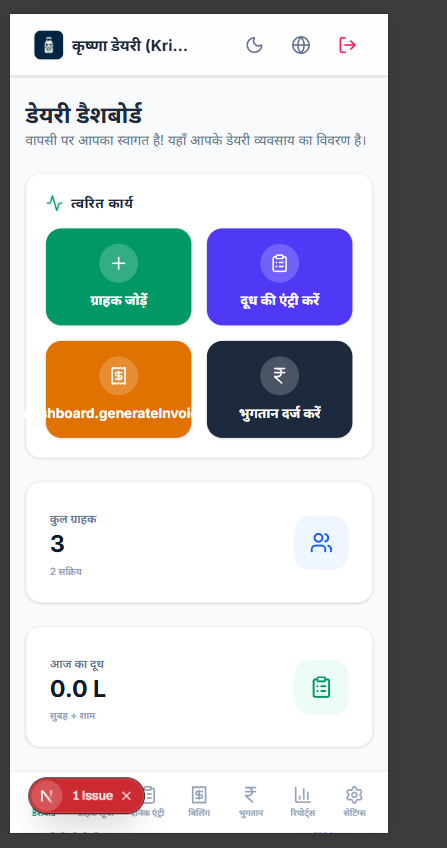
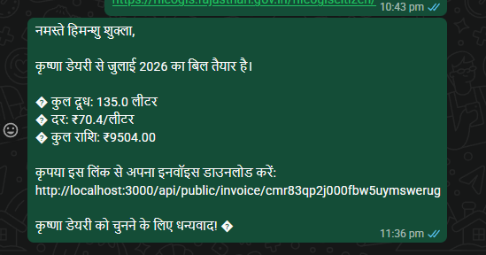
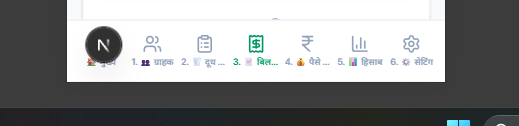

#  DairyBook (डेयरीबुक)

[](https://nextjs.org/)
[](https://tailwindcss.com/)
[](https://www.prisma.io/)
[](https://www.docker.com/)
[](LICENSE)

**DairyBook** is a modern, mobile-first ledger bookkeeping application designed for local milk collection dairies in India. It automates daily morning/evening milk collections (fat, SNF, quantity, price calculations), records payments, generates professional invoices, and **headlessly dispatches WhatsApp bill statements & PDF invoice links** to customers using the integrated Evolution Bot API.

<p align="center">
  
</p>

---

## ✨ Features

- **🥛 Daily Milk Collection Ledger**: Easily record daily morning and evening milk entries (FAT, SNF, Liters) for all customers. Supports automatic cow/buffalo rate calculations.
- **📲 Headless WhatsApp Billing Engine**: Generates monthly invoices and automatically sends custom WhatsApp bill summaries (along with PDF links) directly to customers on their billing dates in the background. No manual input or confirmation required.
- **🔄 Auto-Populated WhatsApp Setup**: A single click on the Settings page boots up a Baileys instance inside a local Evolution API server. Simply scan the generated QR code on-screen to link WhatsApp.
- **📱 100% Mobile Optimized Accordion Forms & Cards**: All page views (Billing registries, Payment lists, Reports, and Settings forms) are fully optimized for mobile devices with responsive stacking, scrollable tabs, and mobile-friendly accordion grids.
- **💾 Auto-Backup & Restore**: Download a complete JSON database snapshot of your ledgers with a single click, or restore previous backups with an easy-to-use warning upload zone.
- **🌐 Bilingual Support**: Toggle between full Hindi (हिंदी) and English dynamically.

---

## 📸 Application Visuals

<table width="100%">
  <tr>
    <td width="50%">
      <p align="center"><strong>⚙️ Mobile-Optimized Accordion Settings</strong></p>
      
    </td>
    <td width="50%">
      <p align="center"><strong>📊 Ledger Statistics & Reports</strong></p>
      
    </td>
  </tr>
</table>

---

## 🚀 AWS Ubuntu Deployment Quickstart

Deploying DairyBook on your Ubuntu AWS EC2 instance is completely automated. We provide a single command setup script that configures everything.

### Step 1: Clone the repository on your EC2 instance
```bash
git clone https://github.com/ronaldweasly/dairybook.git
cd dairybook
```

### Step 2: Make the setup script executable and run it
```bash
chmod +x setup.sh
./setup.sh
```

### What this setup script does:
1. Installs system updates, **Node.js v20 (LTS)**, **Docker**, and **Docker Compose**.
2. Creates a production-ready `.env` file with secure random session secret configurations.
3. Installs dependencies (`npm install`).
4. Performs Prisma migrations and database schema generation.
5. Builds the Next.js bundle for production optimization.
6. Starts the **Evolution WhatsApp API** docker container service in the background on port `8080`.
7. Installs **PM2** globally to host and run the Next.js server on port `3000`.
8. Detects the public AWS IP of your server and prints the final landing page link!

---

## 📲 Zero-Configuration WhatsApp Setup

1. Once deployment completes, visit `http://<YOUR_AWS_PUBLIC_IP>:3000`.
2. Register your account and log in.
3. Go to **Settings (सेटिंग)** -> **WhatsApp QR (व्हाट्सएप QR)** tab.
4. Click **Link WhatsApp (Get QR Code)**.
5. Scan the generated QR code on your phone screen with your WhatsApp. **You are now linked!** Evolution API credentials and database configuration are automatically generated and saved headlessly in the background.

---

## 🛠️ Local Development & Installation

If you wish to run DairyBook locally on your computer:

### 1. Install local dependencies
```bash
npm install
```

### 2. Configure Database & Environment
Create a `.env` file in the root folder:
```env
DATABASE_URL="file:./dev.db"
NEXTAUTH_SECRET="your-secure-random-secret"
NEXTAUTH_URL="http://localhost:3000"
```

Push database schema:
```bash
npx prisma db push
npx prisma generate
```

### 3. Run Evolution API locally via Docker
Make sure Docker is running on your machine, then spin up the container:
```bash
docker-compose up -d
```

### 4. Start Next.js Dev Server
```bash
npm run dev
```
Open `http://localhost:3000` to access the application.

---

## 📄 License
This project is licensed under the MIT License - see the [LICENSE](LICENSE) file for details.
